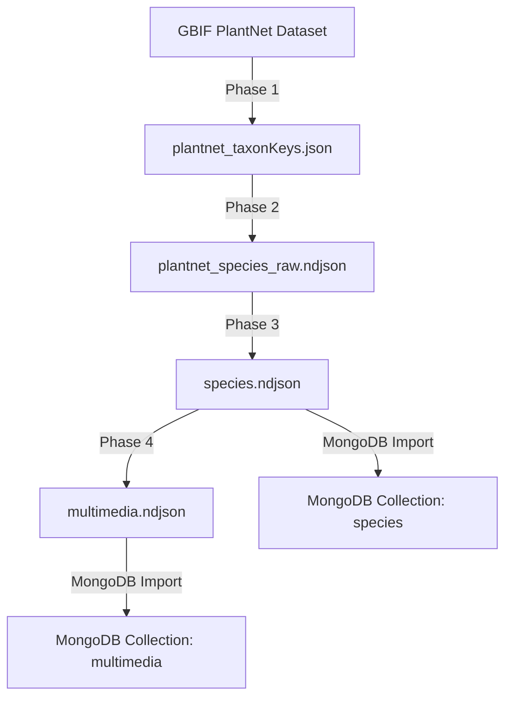

# My-Plants Database

Dieses Repository bündelt und verwaltet die Pflanzendaten für die **My-Plants Lern-App**. Es enthält Scripts zur Datenbeschaffung von GBIF (Global Biodiversity Information Facility) und zur Aufbereitung in ein MongoDB-kompatibles Format.

## 📋 Übersicht

**Zweck:** Bereitstellung von strukturierten Pflanzendaten (botanische Namen, deutsche Namen, Bilder mit Organ-Tags) für die My-Plants App.

**Datenquelle:** GBIF API, primär das [PlantNet observations Dataset](https://www.gbif.org/dataset/7a3679ef-5582-4aaa-81f0-8c2545cafc81)

**Output-Formate:** NDJSON (Newline Delimited JSON) – optimal für MongoDB-Import und Streaming-Verarbeitung

## 🎯 Inhalt der Datenbank

### species.ndjson
- **18.673 Pflanzenarten** (Stand: September 2025)
- **5.464 mit deutschen Namen**
- Felder: `taxonKey`, `scientificName`, `canonicalName`, `germanName`, `germanNames[]`, `rank`, `status`

### multimedia.ndjson
- **3.166.029 Bild-URLs** mit Organ-Tags
- Felder: `taxonKey`, `species`, `organ` (leaf/flower/fruit/bark/habit/other), `occurrenceId`, `url`, `license`, `wilsonScore`
- Alle URLs proxied durch [images.weserv.nl](https://images.weserv.nl/) für On-the-Fly-Optimierung

## 🚀 Quick Start

### Voraussetzungen
- **Node.js** ≥ 18 (für native `fetch` API)
- **npm** oder **yarn**

### Installation

```bash
# Repository klonen
git clone <repository-url>
cd my-plants_database

# Dependencies installieren
npm install
```

### Daten generieren (komplette Pipeline)

```bash
# Phase 1: TaxonKeys sammeln
npm run fetch-keys

# Phase 2: Species-Daten anreichern
npm run enrich-species

# Phase 3: Filtern und bereinigen
npm run filter-species

# Phase 4: Multimedia sammeln
npm run collect-multimedia

# ODER: Alle Phasen nacheinander
npm run build-all
```

### Dauer-Schätzung
- **Phase 1:** ~5-10 Minuten (je nach API-Geschwindigkeit)
- **Phase 2:** ~4-6 Stunden (für ~18k taxonKeys bei Concurrency=10)
- **Phase 3:** ~1 Minute (Filterung)
- **Phase 4:** ~8-12 Stunden (für ~18k Species mit Bildern)

> **Tipp:** Phase 2 und 4 können unterbrochen und fortgesetzt werden (siehe [docs/PROZESS.md](docs/PROZESS.md))

## 📂 Verzeichnisstruktur

```
my-plants_database/
├── README.md                           # Diese Datei
├── docs/
│   ├── PROZESS.md                      # Detaillierte Prozessdokumentation
│   ├── DATENSTRUKTUR.md               # Schema & MongoDB-Integration
│   └── API_REFERENZ.md                # GBIF API Details
├── scripts/
│   ├── 01_fetch_taxonkeys.js          # Phase 1
│   ├── 02_enrich_species.js           # Phase 2
│   ├── 03_filter_species.js           # Phase 3
│   ├── 04_collect_multimedia.js       # Phase 4
│   └── utils/
│       ├── gbif-helpers.js            # GBIF API Funktionen
│       └── filter-helpers.js          # Filter-Utilities
├── data/
│   ├── output/                        # Finale Daten
│   │   ├── species.ndjson
│   │   └── multimedia.ndjson
│   └── intermediate/                  # Zwischenschritte
│       ├── plantnet_taxonKeys.json
│       └── plantnet_species_raw.ndjson
└── package.json
```

## 🔄 Workflow-Übersicht



### Phase-Details

1. **Phase 1: TaxonKeys sammeln**
   - Sammelt alle eindeutigen `taxonKey` aus dem PlantNet-Dataset via GBIF Faceting
   - Output: ~18k taxonKeys

2. **Phase 2: Species anreichern**
   - Ruft für jeden `taxonKey` taxonomische Daten von GBIF ab
   - Normalisiert Synonyme → akzeptierte Namen
   - Sammelt deutsche Trivialnamen
   - Output: Alle Species mit vollständigen Metadaten

3. **Phase 3: Filtern & Bereinigen**
   - Nur `rank: "SPECIES"` + `status: "ACCEPTED"`
   - Nur mit deutschen Namen
   - Entfernt temporäre Felder
   - Output: Bereinigte `species.ndjson`

4. **Phase 4: Multimedia sammeln**
   - Sammelt Bilder für jede Species aus GBIF Occurrences
   - Extrahiert Organ-Tags (leaf, flower, etc.)
   - Proxied URLs durch Weserv
   - Output: `multimedia.ndjson`

## 📊 MongoDB Import

```bash
# Species importieren
mongoimport --uri "mongodb://localhost:27017" \
  --db myflora \
  --collection species \
  --file data/output/species.ndjson

# Multimedia importieren
mongoimport --uri "mongodb://localhost:27017" \
  --db myflora \
  --collection multimedia \
  --file data/output/multimedia.ndjson

# Indexes erstellen (empfohlen)
mongosh --eval '
  use myflora;
  db.species.createIndex({ taxonKey: 1 }, { unique: true });
  db.species.createIndex({ "canonicalName": 1 });
  db.species.createIndex({ "germanName": 1 });
  db.multimedia.createIndex({ taxonKey: 1 });
  db.multimedia.createIndex({ organ: 1 });
'
```

Mehr Details: [docs/DATENSTRUKTUR.md](docs/DATENSTRUKTUR.md)

## 🛠 Konfiguration

Alle Scripts verwenden Konfigurationsobjekte am Anfang der Datei:

```javascript
const CONFIG = {
  DATASET_KEY: '7a3679ef-5582-4aaa-81f0-8c2545cafc81', // PlantNet
  CONCURRENCY: 10,  // Parallele API-Requests
  // ...
};
```

Anpassbare Parameter:
- `CONCURRENCY`: Anzahl paralleler Requests (höher = schneller, aber mehr Last auf GBIF API)
- `PAGE_SIZE`: Anzahl Ergebnisse pro API-Request
- Output-Pfade

## ⚠️ Wichtige Hinweise

### GBIF API Rate Limits
- Die Scripts implementieren automatisches **Retry mit Exponential Backoff** bei 429/5xx Fehlern
- Bei sehr hoher Concurrency kann es zu temporären Timeouts kommen
- **Empfohlen:** `CONCURRENCY: 6-10` für stabile Performance

### Daten-Updates
- GBIF Backbone wird regelmäßig aktualisiert (neue Taxa, geänderte Namen)
- **Empfehlung:** Alle 3-6 Monate Daten neu generieren
- Siehe [docs/PROZESS.md](docs/PROZESS.md) für Delta-Updates

### Lizenzen
- **Daten:** GBIF-Daten unterliegen verschiedenen Lizenzen (siehe `license`-Feld in `multimedia.ndjson`)
- **PlantNet:** Meist CC-BY oder CC-BY-SA
- **Bilder:** Beachte die individuellen Lizenzen pro Bild!

## 📚 Dokumentation

- **[PROZESS.md](docs/PROZESS.md)** – Detaillierte Prozessbeschreibung, API-Calls, Fehlerbehandlung
- **[DATENSTRUKTUR.md](docs/DATENSTRUKTUR.md)** – Schema-Details, MongoDB-Integration, Query-Beispiele
- **[API_REFERENZ.md](docs/API_REFERENZ.md)** – GBIF API Endpoints, Best Practices, Limits

## 🤝 Beitragen

Für Änderungen und Erweiterungen:
1. Branch erstellen: `git checkout -b feature/meine-aenderung`
2. Scripts testen mit Subset der Daten (z.B. nur 100 taxonKeys)
3. Dokumentation aktualisieren
4. Pull Request erstellen

## 📝 Changelog

### v1.0.0 (September 2025)
- ✨ Initiale Refaktorisierung aus Chat-basierten Scripts
- 📦 Modularisierung in 4 klare Phasen
- 📖 Vollständige Dokumentation
- 🧰 Wiederverwendbare Utility-Module
- 🚀 npm Scripts für einfache Ausführung

## 📧 Kontakt

Bei Fragen zum Repository oder den Daten:
- **Projekt:** My-Plants Lern-App
- **Maintainer:** [Dein Name]
- **Issues:** [GitHub Issues Link]

---

**Hinweis:** Dieses Repository dient ausschließlich der Datenvorbereitung für die My-Plants App. Die finalen Daten werden in MongoDB gehostet und von der App konsumiert.
